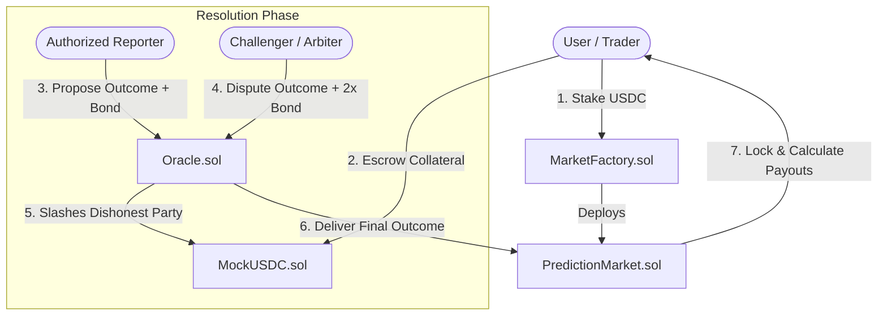

# Decentralized Prediction Market Smart Contract System & Security Research Lab

An end-to-end, production-grade Decentralized Prediction Market smart contract protocol and interactive Security Research Lab designed for a Smart Contract Security Researcher portfolio.

---

## 🏛 System Architecture

The protocol separates market creation, collateral escrow, multi-reporter resolution, and dispute resolution into modular smart contracts:



---

## 🛡 Threat Model & Attack Surface

| Attack Vector | Target Contract | Impact Severity | Primary Mitigation |
| :--- | :--- | :--- | :--- |
| **Oracle Manipulation** | `Oracle.sol` | **Critical** | Mandatory initial reporter bond (100 USDC) + 24-hr dispute window + 2x counter-bond slashing. |
| **Mempool Front-Running** | `PredictionMarket.sol` | **High** | Two-phase state machine with mandatory pre-resolution `LOCKED` state. |
| **Rounding & Truncation** | `PredictionMarket.sol` | **High** | High-precision `1e18` math scaling for proportional payout shares (`(stake * 1e18) / pool`). |
| **Reentrancy Attacks** | `PredictionMarket.sol` | **Critical** | OpenZeppelin-style `ReentrancyGuard` + Checks-Effects-Interactions (CEI) design pattern. |
| **Timestamp Drift** | `PredictionMarket.sol` | **Medium** | State locking independent of exact block timestamp plus explicit dispute grace buffers. |
| **Collusion Attacks** | `Oracle.sol` | **High** | Game-theoretic economic thresholds where counter-bonding rewards render bribery unprofitable. |

---

## 📚 Real-World Incident Analysis

### 1. Oracle Manipulation (Augur Dispute Flaws)
In early prediction markets like Augur v1, single-reporter resolution without sufficient economic bonding enabled malicious reporters to submit false outcomes on low-liquidity markets. The protocol required long resolution delays or global forks to resolve unbonded false reports. Our `Oracle.sol` addresses this by mandating a 100 USDC initial bond, a 24-hour dispute window, and a 2x counter-bond slashing penalty that economically disincentivizes false proposals.

### 2. Mempool Front-Running & MEV (Polymarket Oracle Edge Cases)
In 2024, MEV searchers monitored public mempools for oracle resolution transactions on decentralized prediction markets. Upon spotting an incoming resolution transaction, bots inserted high-priority gas transactions to stake on the confirmed winning outcome milliseconds before the resolution landed. `PredictionMarket.sol` neutralizes this by enforcing an explicit `LOCKED` state prior to resolution, rejecting any new stakes once the deadline arrives.

### 3. Precision Loss & Rounding (ERC-4626 & Defi Yield Drain)
Precision loss via unscaled integer division has plagued multiple DeFi protocols (such as early ERC-4626 vault inflation attacks). When calculating proportional shares with `(userStake * totalPool) / winningPool`, micro-stakers suffer 100% loss due to integer division truncating fractional payouts to zero. Our secured contract uses `1e18` precision scaling (`shareRatio = (userStake * 1e18) / winningPool`), preserving exact wei values.

### 4. Reentrancy Exploits (The DAO & Lendf.Me)
The landmark $60M DAO exploit of 2016 and the Lendf.Me hack stemmed from transferring collateral (or native tokens/ERC-777 callbacks) before updating internal user balances (`hasClaimed[msg.sender] = true`). In `VulnerablePredictionMarket.sol`, `usdc.transfer()` is executed prior to setting state, enabling recursive callback drains. `PredictionMarket.sol` strictly enforces Checks-Effects-Interactions (CEI) alongside `ReentrancyGuard`.

### 5. Timestamp Manipulation (Validator Drift / Miner Front-Running)
Ethereum miners and PoS validators have up to 12–15 seconds of block timestamp leeway (`block.timestamp`). In naive contracts checking `block.timestamp < deadline`, validators can manipulate block timestamps to submit late bets after real-world event results are known. Our protocol decouples event resolution from instantaneous block timestamps using explicit state locks and grace buffers.

### 6. Staker-Reporter Collusion (51% Oracle Bribery)
When a majority staker holding 80%+ of losing positions bribes a trusted reporter, unbonded markets collapse into mob rule. Our system mitigates this by enforcing game-theoretic bonding thresholds: any minority participant can challenge the false report with a 2x bond, triggering independent arbitration where the corrupt reporter's bond is completely slashed and awarded to the challenger.

---

## 🚀 Repository Structure

```
├── contracts/
│   ├── src/
│   │   ├── MockUSDC.sol                     # ERC-20 6-decimal test collateral
│   │   ├── MarketFactory.sol                # Factory for deploying prediction markets
│   │   ├── Oracle.sol                       # Multi-reporter bonded dispute oracle
│   │   ├── PredictionMarket.sol             # Production-grade secured prediction market
│   │   └── VulnerablePredictionMarket.sol   # Intentionally vulnerable contract for contrast
│   └── test/
│       ├── OracleManipulation.t.sol         # Single vs multi-reporter dispute PoC
│       ├── FrontRunning.t.sol               # Mempool arbitrage vs state lock PoC
│       ├── RoundingErrors.t.sol             # Unscaled division vs 1e18 precision PoC
│       ├── Reentrancy.t.sol                 # External call reentrancy vs CEI PoC
│       ├── TimestampManipulation.t.sol     # Validator drift vs grace buffer PoC
│       └── CollusionScenario.t.sol          # Whale bribery vs economic slash PoC
├── src/                                     # Interactive React + Ethers Frontend
│   ├── App.jsx                              # 3-Tab UI: Hub, Exploit Lab, Audit Viewer
│   ├── ethersSimulator.js                   # In-memory EVM state machine & simulator
│   └── index.css                            # Dark glassmorphism styling
├── AUDIT.md                                 # Formal Smart Contract Audit Report
└── README.md                                # Project Documentation & Architecture
```

---
## 🌐 Live Demo

Explore the deployed application here: **[https://prediction-market-security-lab.vercel.app](https://prediction-market-security-lab.vercel.app/)**

Navigate through the **Prediction Markets Hub**, step through live exploits in the **Security Exploit Lab**, and review the **Audit Report Viewer** — all directly in your browser, no setup required.

---

## 💻 Running the Security Research Lab Locally

1. Install dependencies:
   ```bash
   npm install
   ```
2. Start the interactive React frontend & EVM simulator:
   ```bash
   npm run dev
   ```
3. Open `http://localhost:5173` to explore the **Prediction Markets Hub**, step through live exploits in the **Security Exploit Lab**, and review the **Audit Report Viewer**.
